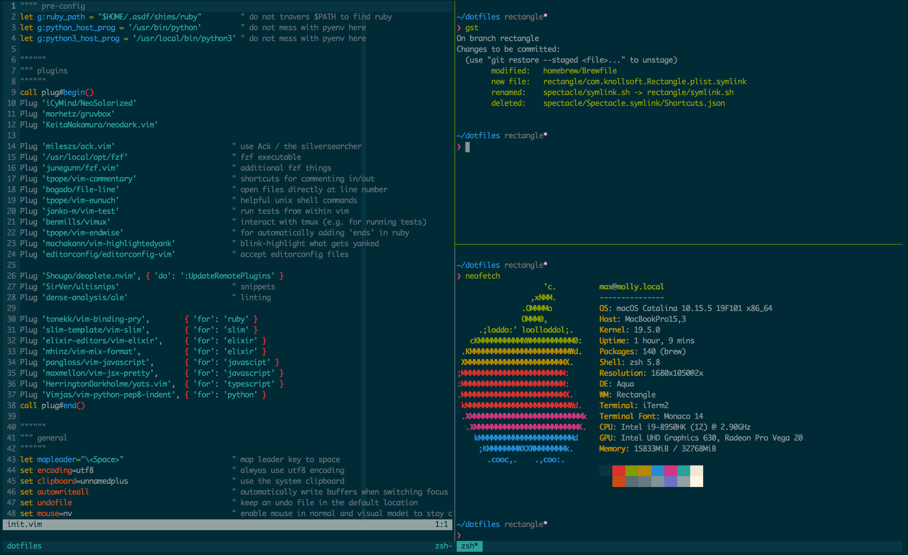

# dotfiles 🏗

How I set up my dev system.



## About

My dotfiles follow [holman](https://github.com/holman/dotfiles)'s concept of _"topical"_ organization. Each topic has its own directory with special filename conventions ⚡️:

- **bin/**: contains executables added to `$PATH`
- **topic/install**: script executed when installing/updating the topic
- **topic/link**: script executed when symlinking the topic
- **topic/name.symlink**: files picked up by the `link` script of the topic

_(Note: the `homebrew` topic is always evaluated first as other topics depend on it.)_

## Installation

_(on new computer: [set up ssh keys](https://docs.github.com/en/github/authenticating-to-github/generating-a-new-ssh-key-and-adding-it-to-the-ssh-agent) first)_

```bash
# start in the home directory
cd

# clone repository
git clone --recursive git@github.com:klappradla/dotfiles.git

# navigate into the new directory
cd dotfiles

# run the install script
script/setup
```

To install topics individually:

```bash
script/install <topic>
```

## Tips & Tricks

- Change/disable macOS' default keyboard shortcuts for _"Input Sources"_ if you want to use <kbd>CTRL</kbd> + <kbd>Space</kbd> as prefix in Tmux.

_See [docs](./DOCS.md) for additional help._
